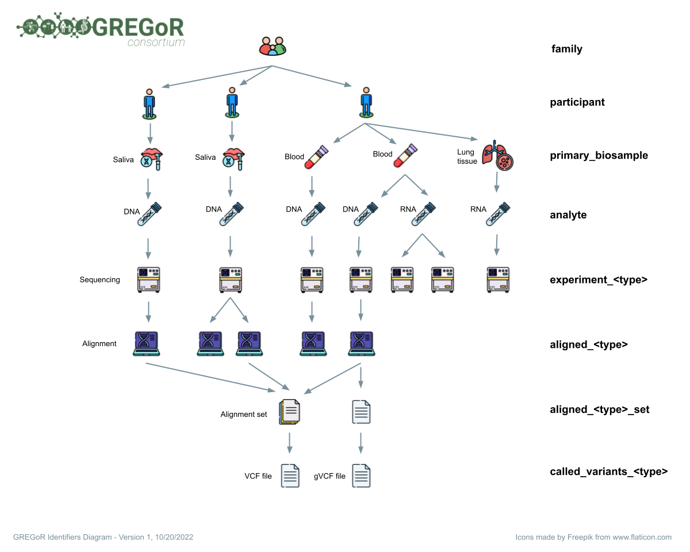

# gregor_data_models

A repository for version control of the [GREGoR Consortium](https://gregorconsortium.org/) data model encoded as JSON. 

The JSON is defined to be easily translated to Database Markup Language (DBML) using the [AnvilDataModels](https://github.com/UW-GAC/AnvilDataModels) R package. The DBML file is rendered using [dbdiagram.io](https://dbdiagram.io/d/624227bbbed6183873142297) for visualization.

Additional documentation and information is available via the google sheets-based [data dictionary](https://drive.google.com/drive/folders/1Ozgynjylc4Pia0cUIMCV6scAtCvwQPrk) for the data model. In case of any discrepency, the .json file in this repository is the authoritative version of the Consortium data model. 

